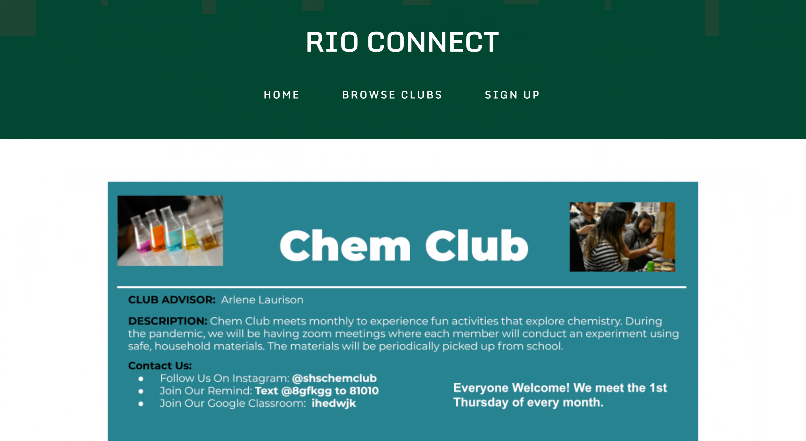

# RIO Connect

 

RIO Connect is an app designed to help students at the University of Hawaii at Manoa find clubs and groups that they may be interested in. Registered Independent Organizations (RIOs) are student organizations that are independent of the University.

## Table of Contents

- [Team Contract](#team-contract)
- [Goals of the Project](#goals-of-the-project)
- [System Features](#system-features)
- [User Interface Walkthrough](#user-interface-walkthrough)
  - [Landing Page](#landing-page)
  - [User Home Page](#user-home-page)
  - [Admin Home Page](#admin-home-page)
  - [Club Admin Home Page](#club-admin-home-page)
  - [Browse Clubs Page](#browse-clubs-page)

## Team Contract

[https://docs.google.com/document/d/1AReDgCwOPcw_MYl7dIruAtm2QclpYCjk_QXnigj9xfA/edit](https://docs.google.com/document/d/1AReDgCwOPcw_MYl7dIruAtm2QclpYCjk_QXnigj9xfA/edit)

  <iframe src="https://docs.google.com/document/d/e/2PACX-1vRlUWyxpbTLGUoRJTj5G0IQmo7wPbHizd8CfejfiRtNBtuXRpMyoMGcgGOrKx0IQFO8AfVFNOXj35gp/pub?embedded=true" style="width: 100%; height: 500px"></iframe>

## Goals of the Project

The goal of this project is to provide a centralized directory for UH Manoa student clubs. This directory will list all RIOs, and provide descriptions and contact information for each one. The project will also allow for editing and removing club listings by authorized administrators.

## System Features

The system provides the following features:
* Storing, editing, and removing club information.
* Tagging clubs with interest categories (athletic, academic, social, etc.)
* Filter clubs by desired interest category

## User Interface Walkthrough

### Landing Page

Landing page that provides a brief introduction to RIO Connect.

 

### User Home Page

Home page of the user.

 

### Admin Home Page

This type of user is able to control all club entries, and assign edit permissions to club admins.

 

### Club Admin Home Page

This type of user is able to edit club entries for the clubs assigned.

 

### Browse Clubs Page

Lists all clubs by default. Users can discriminate clubs based on name and interest area.

 

