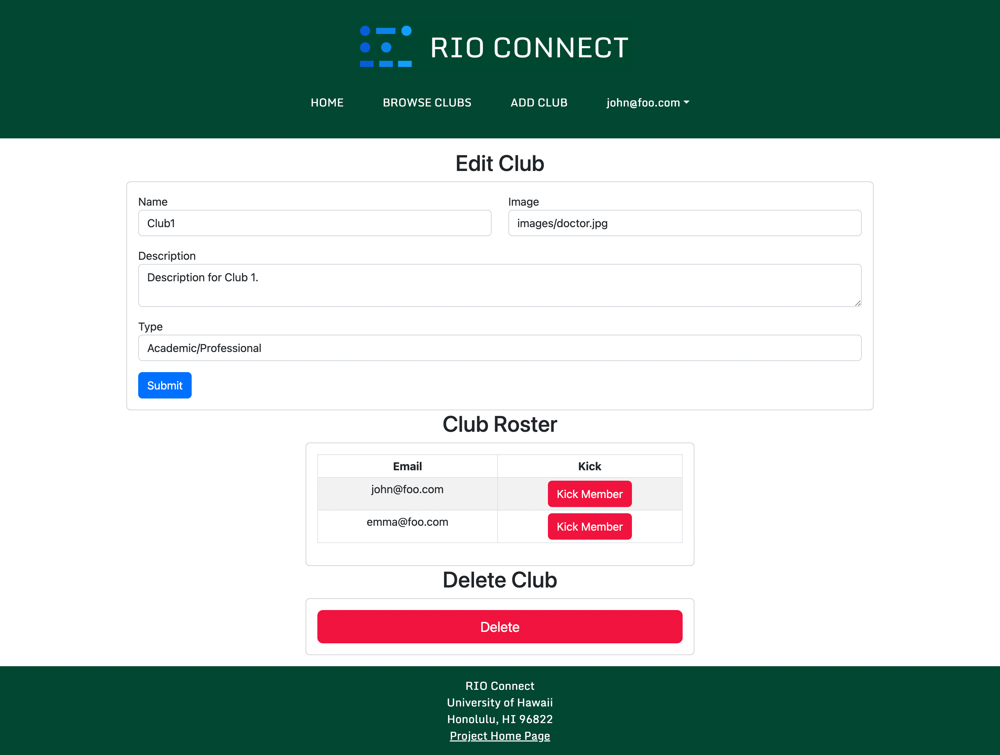

# RIO Connect

## Overview

<p align="center">
 
</p>

RIO Connect is an app designed to help students at the University of Hawaii at Manoa find clubs and groups that they may be interested in. Registered Independent Organizations (RIOs) are student organizations that are independent of the University. The University of Hawaii at Manoa has many Registered Independent Organizations or clubs that many students do not know about but may be interested in joining. The purpose of RIO Connect is to enhance the UH Manoa student community by facilitating club discovery and access. Students can create profiles, join and create clubs and browse the currently existing clubs by  club type. 

## Table of Contents

- [Team Administration](#team-administration)
  - [Team Members](#team-members)
  - [Team Contract](#team-contract)
  - [GitHub Organization](#github-organization)
- [Goals of the Project](#goals-of-the-project)
- [System Features](#system-features)
- [User Interface Walkthrough](#user-interface-walkthrough)
  - [Landing Page](#landing-page)
  - [User Home Page](#user-home-page)
  - [Admin Home Page](#admin-home-page)
  - [Browse Clubs Page](#browse-clubs-page)
  - [Create a Club Page](#create-a-club-page)
  - [Edit Club Page](#edit-club-page)
  - [Login Page](#login-page)
  - [Signup Page](#signup-page)
- [Continuous Integration](#continuous-integration)
- [Community Feedback](#community-feedback)
- [Developer Guide](#developer-guide)
- [Milestones](#milestones)
  - [Milestone 1](#milestone-1)
  - [Milestone 2](#milestone-2)
  - [Milestone 3](#milestone-3)
- [Deployment](#deployment)

## Team Administration

### Team Members
#### Nathan Getchel - [nathan-getchel](https://github.com/nathan-getchel)
#### Alex Montoya - [montoyaoa](https://github.com/montoyaoa)
#### Aaron Nezzer - [A-Nezzer](https://github.com/A-Nezzer)
#### Sean Sunoo - [Ssunoo2](https://github.com/Ssunoo2)
#### Jake Walker - [jakeswalker](https://github.com/jakeswalker)

### Team Contract

[Link to contract](https://docs.google.com/document/d/1AReDgCwOPcw_MYl7dIruAtm2QclpYCjk_QXnigj9xfA/edit)

<div style="width: 100%;">
  <iframe src="https://docs.google.com/document/d/e/2PACX-1vRlUWyxpbTLGUoRJTj5G0IQmo7wPbHizd8CfejfiRtNBtuXRpMyoMGcgGOrKx0IQFO8AfVFNOXj35gp/pub?embedded=true" style="width: 100%; height: 500px"></iframe>
</div>

### GitHub Organization
[Link to GitHub Organization](https://github.com/rio-connect)

## Goals of the Project

The goal of this project is to provide a centralized directory for UH Manoa student clubs. This directory will list all RIOs, and provide descriptions and contact information for each one. The project will also allow for editing and removing club listings by authorized administrators.

## System Features

The system provides the following features:
* Storing, editing, and removing club information.
* Tagging clubs with interest categories (athletic, academic, social, etc.)
* Filter clubs by desired interest category

## User Interface Walkthrough

### Landing Page

Landing page that provides a brief introduction to RIO Connect. Users can log in, sign up, or browse clubs.

<p align="center">
 
</p>

### User Home Page

Home page of a regular user. This page shows the user's contact information, as well as any clubs and interest areas they have saved.

<p align="center">
 
</p>

### Admin Home Page

Home page of a site admin. This page shows the admin's contact information, as well as any clubs and interest areas they have saved. The admin can also select any club and go to its edit page.

<p align="center">
 
</p>

### Browse Clubs Page

Lists all clubs by default. Users can discern clubs based on name and interest area.

<p align="center">
 
</p>

### Create a Club Page

Allows a user to create a club. Current user automatically becomes owner.

<p align="center">
 
</p>

### Edit Club Page

Allows site admin and club owners to edit club information as well as assign user as a club member or club owner.

<p align="center">
 
</p>

### Login Page

Allows login and with a signin option, to access personal or club account.

<p align="center">
 
</p>

### Signup Page

Allows new users to create an account with the site, to allow a customized club-viewing experience.

<p align="center">
 
</p>

## Continuous Integration

[](https://github.com/rio-connect/rio-connect/actions/workflows/ci.yml)

RIO Connect uses GitHub Actions to automatically run ESLint and TestCafe each time a commit is made to the default branch. You can see the results of all recent “workflows” at [https://github.com/rio-connect/rio-connect/actions](https://github.com/rio-connect/rio-connect/actions).

## Community Feedback

We are interested in your experience using Rio Connect! If you would like, please take a couple of minutes to fill out the [Rio Connect Feedback Form](https://docs.google.com/forms/d/1X0cSERm66ZapfSLwUToNWUevdz_jKCKSPyyuHL5Cp2A/edit). It contains only five short questions and will help us understand how to improve the system.

The following are some of the feedback we recieved from other UH students:

Andee: When in my profile it shows that I am in clubs that I did not select, so getting it to show only the clubs that I had joined. The add club feature could be improved for easier user access.

Eliya: Overall, I love the visual appearance of the website. I think that it has an easy-to-follow user navigation system as well. However, I would make sure to fix the "Add club" mechanism, as well as the mechanism to edit the clubs you are a part of, as it doesn't seem to be fully working. I think this is a really well made website, though, and could prove useful for any student wanting to join a new club.

Mercy: Everything looks and works well, a couple ideas of things that could be added is a when2meet or something similar to show meeting times, a separate section where owners can look at their clubs separate from clubs that they've joined as a member, and then somewhere on the website with contact info for admin or incase of error.

Alex: Images take a while to load (not cause of my internet or computer), Dark theme

Sarah Haanen (Hui Ala Pono Club President): Nothing, it is intuitive and looks great on mobile.

Timothy : The website seems to be efficiently designed for finding clubs. Perhaps maybe a way to search for other users and add them as a friend to see what clubs they're in to give it a social aspect?

Hannah: I think the website looks AMAZING! I truly didn't know we had that many clubs! My one minor suggestion is adding an option where it immediately allows users to go from the letter "A" category to the letter "M" category without having to scroll all the way down; like an "A / B / C / D..." type of interface to make it even easier and quicker to navigate. Overall though, I think the website is efficient and effective- good job! :)

## Developer Guide

This section provides information of interest to Meteor developers wishing to use rio connect in their own development.

## Installation

First, [install Meteor](https://www.meteor.com/install).

Second, visit the Rio Connect application github page and download the sources as a zip file or make a fork of the repo either . However you do it, download a copy of the repo to your local computer.

Third, cd into the rio-connect/app directory and install libraries with:

```
$ meteor npm install
```

Fourth, run the system with:

```
$ meteor npm run start
```

If all goes well, the application will appear at [http://localhost:3000](http://localhost:3000).

### Application Design

Rio Connect is based upon [meteor-application-template-react](https://ics-software-engineering.github.io/meteor-application-template-react/) and [meteor-example-form-react](https://ics-software-engineering.github.io/meteor-example-form-react/). Please use the videos and documentation at those sites to better acquaint yourself with the basic application design and form processing in Rio Connect.

### Data model

The rio connect data model consists of two "primary" collections: Profiles and Clubs. Profiles contain user information such as email (userID), name and phone number. Clubs contain descriptor types such as a club description in which meeting times can be advertised, owner name and owner email, club type (for search filtering), default image and an array of members.

Additional Join collections are present in the code, but have not currently been implemented. These include ClubInterests, Interests, ProfileInterests, and ProfileClubs. The idea is that each entry indicates that there is a relationship between those two entities. Now, to find all the Clubs associated with a Profile, just search this collection for all the documents that match the Profile, then extract the Club field. Going the other way is just as easy: to find all the Profiles associated with a Club, just search the collection for all documents matching the Club, then extract the Profile field. The Interests collection was originally intended to match a user's interests with a a club type.

## Initialization

The [config](https://github.com/rio-connect/rio-connect/tree/master/config) directory is intended to hold settings files.  The repository contains one file: [config/settings.development.json](https://github.com/rio-connect/rio-connect/tree/master/config/settings.development.json).

This file contains default definitions for Profiles and Clubs.

### Quality Assurance
#### ES lint

Rio connect includes a [.eslintrc](https://github.com/rio-connect/rio-connect/blob/master/app/.eslintrc.js) file to define the coding style adhered to in this application. You can invoke ESLint from the command line as follows:

```
meteor npm run lint
```

Here is sample output indicating that no ESLint errors were detected:

```
$ meteor npm run lint

> meteor-application-template-react@ lint /Users/sean/Documents/GitHub/rio-connect/app
> eslint --quiet --ext .jsx --ext .js ./imports && eslint --quiet --ext .js ./tests

$
```

ESLint should run without generating any errors.

It's significantly easier to do development with ESLint integrated directly into your IDE (such as IntelliJ).

#### End to End Testing

Rio connect uses [TestCafe](https://devexpress.github.io/testcafe/) to provide automated end-to-end testing.

The rio connect end-to-end test code employs the page object model design pattern.  In the [rio-connect tests/ directory](https://github.com/rio-connect/rio-connect/tree/master/app/tests), the file [tests.testcafe.js](https://github.com/rio-connect/rio-connect/blob/master/app/tests/tests.testcafe.js) contains the TestCafe test definitions. The remaining files in the directory contain "page object models" for the various pages in the system (i.e. Home, Landing, Browse Clubs, etc.) as well as one component (navbar). This organization makes the test code shorter, easier to understand, and easier to debug.

To run the end-to-end tests in development mode, you must first start up a rio connect instance by invoking `meteor npm run start` in one console window.

Then, in another console window, start up the end-to-end tests with:

```
meteor npm run testcafe
```

You will see browser windows appear and disappear as the tests run.  If the tests finish successfully, you should see the following in your second console window:

```
user@Laptop-von-Sean app % meteor npm run testcafe

> meteor-application-template-react@ testcafe /Users/user/Documents/GitHub/rio-connect/app
> testcafe chrome tests/*.testcafe.js

 Running tests in:
 - Chrome 112.0.0.0 / Ventura 13

 rio-connect localhost test with default db
 ✓ Test that landing page shows up
 ✓ Test that signin and signout work for Emma Lee
 ✓ Test that signin and signout work for John Smith
 ✓ Test that signin and signout work for Admin
 ✓ Test that BrowseClubsPage works for users
 ✓ Test that add and edit clubs work
 ✓ Test that the UserPage displays correct information for emma@foo.com
 ✓ Test that the UserPage displays correct information for john@foo.com
 ✓ Test that the UserPage displays correct information for admin@foo.com


 9 passed (3m 38s)

```


You can also run the testcafe tests in "continuous integration mode".  This mode is appropriate when you want to run the tests using a continuous integration service like Jenkins, Semaphore, CircleCI, etc.  In this case, it is problematic to already have the server running in a separate console, and you cannot have the browser window appear and disappear.

To run the testcafe tests in continuous integration mode, first ensure that rio connect is not running in any console.

Then, invoke `meteor npm run testcafe-ci`.  You will not see any windows appear.  When the tests finish, the console should look like this:


```
user@Laptop-von-Sean app % meteor npm run testcafe-ci

> meteor-application-template-react@ testcafe-ci /Users/user/Documents/GitHub/rio-connect/app
> testcafe chrome:headless tests/*.testcafe.js -q --app "meteor npm run start"

 Running tests in:
 - Chrome 112.0.5615.137 / Ventura 13

 rio-connect localhost test with default db
 ✓ Test that landing page shows up (unstable)
 ✓ Test that signin and signout work for Emma Lee
 ✓ Test that signin and signout work for John Smith
 ✓ Test that signin and signout work for Admin
 ✓ Test that BrowseClubsPage works for users
 ✓ Test that add and edit clubs work
 ✓ Test that the UserPage displays correct information for emma@foo.com
 ✓ Test that the UserPage displays correct information for john@foo.com
 ✓ Test that the UserPage displays correct information for admin@foo.com


 9 passed (6m 38s)

```


All the tests pass, but the first test is marked as "unstable". At the time of writing, TestCafe fails the first time it tries to run a test in this mode, but subsequent attempts run normally. To prevent the test run from failing due to this problem with TestCafe, we enable [testcafe quarantine mode](https://devexpress.github.io/testcafe/documentation/guides/basic-guides/run-tests.html#quarantine-mode).

The only impact of quarantine mode should be that the first test is marked as "unstable".

## Milestones

### Milestone 1
The Goal of Milestone 1 was to create mockup pages and a few skeletal react pages to build upon in the future.

[M1 Project Board on GitHub](https://github.com/orgs/rio-connect/projects/1)

### Milestone 2
The Goal of Milestone 2 was to implement functioning pages that interact with the data models set in place.

[M2 Project Board on GitHub](https://github.com/orgs/rio-connect/projects/2)

### Milestone 3
The Goal of Milestone 3 is to add increased functionality and complexity to the existing app to produce a polished final project.

[M3 Project Board on GitHub](https://github.com/orgs/rio-connect/projects/3)

## Deployment
[Link to deployed app](https://rio-connect.com/)

