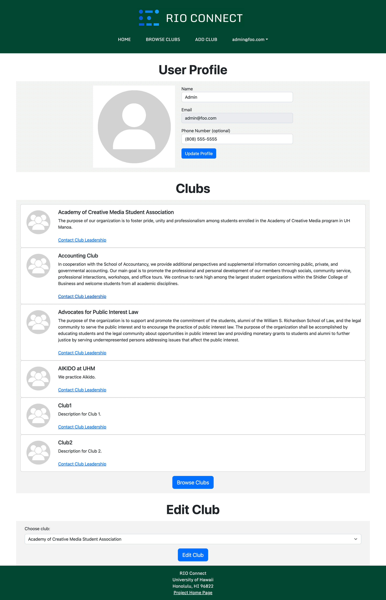
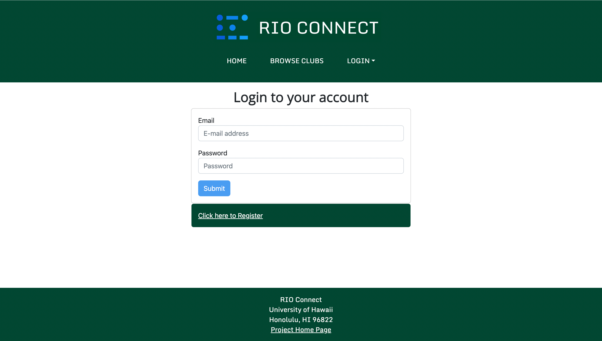

# RIO Connect

 

RIO Connect is an app designed to help students at the University of Hawaii at Manoa find clubs and groups that they may be interested in. Registered Independent Organizations (RIOs) are student organizations that are independent of the University.

## Table of Contents

- [Team Administration](#team-administration)
  - [Team Members](#team-members)
  - [Team Contract](#team-contract)
  - [GitHub Organization](#github-organization)
- [Goals of the Project](#goals-of-the-project)
- [System Features](#system-features)
- [User Interface Walkthrough](#user-interface-walkthrough)
  - [Landing Page](#landing-page)
  - [User Home Page](#user-home-page)
  - [Admin Home Page](#admin-home-page)
  - [Browse Clubs Page](#browse-clubs-page)
  - [Create a Club Page](#create-a-club-page)
  - [Edit Club Page](#edit-club-page)
  - [Login Page](#login-page)
  - [Signup Page](#signup-page)
- [Continuous Integration](#continuous-integration)
- [Milestones](#milestones)
  - [Milestone 1](#milestone-1)
  - [Milestone 2](#milestone-2)
- [Deployment](#deployment)

## Team Administration

### Team Members
#### Nathan Getchel - [nathan-getchel](https://github.com/nathan-getchel)
#### Alex Montoya - [montoyaoa](https://github.com/montoyaoa)
#### Aaron Nezzer - [A-Nezzer](https://github.com/A-Nezzer)
#### Sean Sunoo - [Ssunoo2](https://github.com/Ssunoo2)
#### Jake Walker - [jakeswalker](https://github.com/jakeswalker)

### Team Contract

[Link to contract](https://docs.google.com/document/d/1AReDgCwOPcw_MYl7dIruAtm2QclpYCjk_QXnigj9xfA/edit)

  <iframe src="https://docs.google.com/document/d/e/2PACX-1vRlUWyxpbTLGUoRJTj5G0IQmo7wPbHizd8CfejfiRtNBtuXRpMyoMGcgGOrKx0IQFO8AfVFNOXj35gp/pub?embedded=true" style="width: 100%; height: 500px"></iframe>

### GitHub Organization
[Link to GitHub Organization](https://github.com/rio-connect)

## Goals of the Project

The goal of this project is to provide a centralized directory for UH Manoa student clubs. This directory will list all RIOs, and provide descriptions and contact information for each one. The project will also allow for editing and removing club listings by authorized administrators.

## System Features

The system provides the following features:
* Storing, editing, and removing club information.
* Tagging clubs with interest categories (athletic, academic, social, etc.)
* Filter clubs by desired interest category

## User Interface Walkthrough

 

### Landing Page

Landing page that provides a brief introduction to RIO Connect. Users can log in, sign up, or browse clubs.

 

### User Home Page

Home page of a regular user. This page shows the user's contact information, as well as any clubs and interest areas they have saved.

 

### Admin Home Page

Home page of a site admin. This page shows the admin's contact information, as well as any clubs and interest areas they have saved. The admin can also select any club and go to its edit page.

 

### Browse Clubs Page

Lists all clubs by default. Users can discern clubs based on name and interest area.

 

### Create a Club Page

Allows a user to create a club. Current user automatically becomes an admin.

 

### Edit Club Page

Allows site admin and club owners to edit club information as well as assign user as a club member or club owner.

 

### Login Page

Allows login and with a signin option, to access personal or club account.

 

### Signup Page

Allows new users to create an account with the site, to allow a customized club-viewing experience.

 

## Continuous Integration

RIO Connect uses GitHub Actions to automatically run ESLint and TestCafe each time a commit is made to the default branch. You can see the results of all recent “workflows” at [https://github.com/rio-connect/rio-connect/actions](https://github.com/rio-connect/rio-connect/actions).

## Milestones

### Milestone 1
[M1 Project Board on GitHub](https://github.com/orgs/rio-connect/projects/1)

### Milestone 2
[M2 Project Board on GitHub](https://github.com/orgs/rio-connect/projects/2)

## Deployment
[Link to deployed app](http://www.rio-connect.com/)
